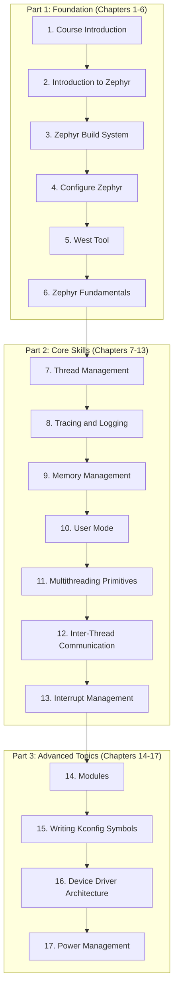

# Zephyr RTOS Development Course

Welcome to the comprehensive Zephyr Real-Time Operating System (RTOS) course! This repository contains all the materials needed to transform you from an embedded systems enthusiast into a confident Zephyr developer capable of building professional-grade, real-time applications.

## What to Expect

This course is designed to be a hands-on, practical guide to modern embedded systems development with Zephyr. The codebase reflects professional practices and is structured to guide you from fundamental concepts to advanced, real-world applications.

- **Structured Learning:** The course is divided into 17 chapters, each with a dedicated directory containing `introduction.md`, `theory.md`, and `lab.md` files.
- **Hands-On Labs:** Every chapter includes detailed lab exercises designed to be built and run. The source code for these labs is provided directly within the `lab.md` files.
- **Modern Tooling:** You will master the modern Zephyr development workflow using tools like the `west` meta-tool, `CMake` for building, `Kconfig` for feature configuration, and the `Device Tree` for hardware description.
- **Target Hardware:** The primary hardware target for this course is the **Raspberry Pi 4B**, with concepts applicable to a wide range of other Zephyr-supported boards.

## Course Structure

The course is divided into three main phases, taking you from basic setup to advanced system architecture.

## Key Learning Areas

- **Zephyr Fundamentals:** Learn the core concepts of the Zephyr RTOS, including its architecture, build system (`west` and `CMake`), and configuration systems (`Kconfig` and `Device Tree`).
- **Hardware Interaction:** Master GPIO, I2C, and other peripheral communication through Zephyr's hardware abstraction layer.
- **Concurrent Programming:** Dive deep into thread management, synchronization primitives (mutexes, semaphores), and inter-thread communication mechanisms (message queues, Zbus).
- **System Security & Stability:** Understand and implement user mode for process isolation and memory protection.
- **Debugging and Observability:** Use Zephyr's powerful logging and tracing features to debug and optimize complex concurrent systems.
- **Professional Architectures:** Learn to structure your applications using modules, write custom Kconfig symbols for configurability, and develop robust device drivers.
- **Power Management:** Master the techniques for building power-efficient, battery-powered devices.

## Hardware and Software Requirements

- **Primary Hardware:** Raspberry Pi 4B
- **Development Environment:** A Linux, macOS, or Windows machine with the Zephyr SDK installed.
- **Recommended IDE:** VS Code with the official Zephyr extension.
- **Key Tools:** `west`, `git`, Python 3.8+

## How to Use This Repository

1.  Navigate to the `course_content` directory.
2.  Start with `chapter_01_course_introduction` and proceed chronologically.
3.  Within each chapter directory, read the `introduction.md` and `theory.md` files to understand the concepts.
4.  Follow the `lab.md` file to complete the hands-on exercises. The lab files contain all the necessary code snippets and build commands.
5.  The `zephyr` directory in the parent folder contains the Zephyr RTOS source code, which serves as the reference for this course.

This repository is designed to be a complete, self-contained resource for learning Zephyr RTOS development.
