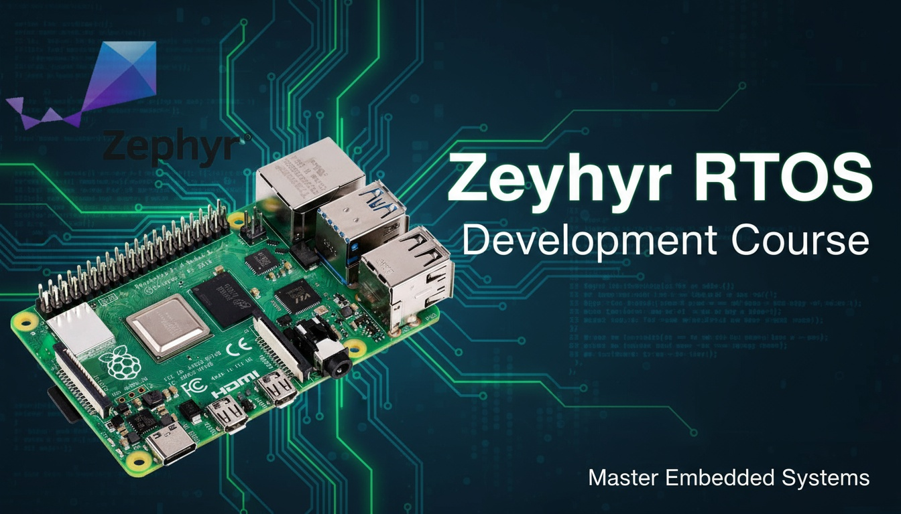

# Zephyr RTOS Development Course

Welcome to the Zephyr RTOS Development Course! This repository provides everything you need to master Zephyr, from foundational concepts to hands-on labs. Whether you're new to embedded systems or looking to deepen your expertise, you'll find step-by-step guidance, practical examples, and resources to help you build robust, real-time applications.

Use this page to navigate chapters, access setup instructions, and explore labs. Start your journey to becoming a confident Zephyr developer!

## Course navigation

- [Chapter 1 — Course Introduction](chapter_01_course_introduction/)
- [Chapter 2 — Introduction to Zephyr](chapter_02_introduction_to_zephyr/)
- [Chapter 3 — Zephyr Build System](chapter_03_zephyr_build_system/)
- [Chapter 4 — Configure Zephyr](chapter_04_configure_zephyr/)
- [Chapter 5 — West Tool](chapter_05_west/)
- [Chapter 6 — Zephyr Fundamentals](chapter_06_zephyr_fundamentals/)
- [Chapter 7 — Thread Management](chapter_07_thread_management/)
- [Chapter 8 — Tracing and Logging](chapter_08_tracing_and_logging/)
- [Chapter 9 — Memory Management](chapter_09_memory_management/)
- [Chapter 10 — User Mode](chapter_10_user_mode/)
- [Chapter 11 — Traditional Multithreading Primitives](chapter_11_traditional_multithreading_primitives/)
- [Chapter 12 — Inter-thread Communication](chapter_12_inter-thread_communication/)
- [Chapter 13 — Interrupt Management](chapter_13_interrupt_management/)
- [Chapter 14 — Modules](chapter_14_modules/)
- [Chapter 15 — Writing Kconfig Symbols](chapter_15_writing_kconfig_symbols/)
- [Chapter 16 — Device Driver Architecture](chapter_16_device_driver_architecture/)
- [Chapter 17 — Power Management](chapter_17_power_management/)
- [Chapter 18 — Capstone Project](chapter_18_capstone_project/)

## How to use this site

- Click a chapter to open its landing page. Each chapter contains: Introduction, Theory, and Lab.
- If a chapter page is missing, it will be added soon — you can also browse the repository's docs/ directory on GitHub.

## Contributing

Contributions and corrections are welcome. See [CONTRIBUTING.md](CONTRIBUTING.md) and [CONDUCT.md](CONDUCT.md) for guidelines.