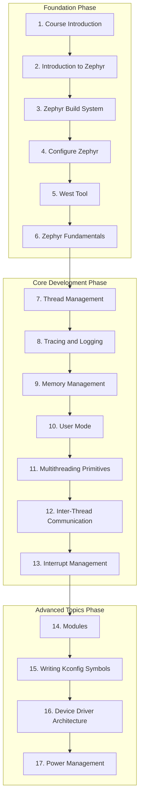

# Chapter 1: Course Introduction

---
[Introduction](./README.md) | [Course Home](../README.md)

---

## Welcome to Zephyr RTOS Development

Welcome to the comprehensive Zephyr Real-Time Operating System (RTOS) course! This course will transform you from an embedded systems enthusiast into a confident Zephyr developer capable of building production-grade, real-time embedded applications using modern tools and workflows.

## What You'll Master

By completing this course, you will gain the skills to:

**Core Competencies:**

* Design and implement real-time embedded applications using Zephyr RTOS
* Configure and customize Zephyr for specific hardware platforms and requirements
* Master the West build system and modern embedded development workflows
* Implement thread management, synchronization, and inter-process communication
* Develop device drivers and integrate hardware peripherals
* Apply power management techniques for battery-powered devices
* Debug and optimize Zephyr applications for performance and reliability

**Real-World Applications:**

From IoT sensor networks and industrial automation to medical devices and autonomous systems, you'll learn to build the embedded software that powers our connected world.

## Who This Course Is For

**Target Audience:**

* Embedded systems developers wanting to learn modern RTOS development
* Engineers transitioning from bare-metal or other RTOS platforms to Zephyr
* Students and professionals in IoT, robotics, and industrial automation
* Open-source enthusiasts interested in contributing to the Zephyr project

**Prerequisites:**

* Basic C programming knowledge
* Understanding of microcontroller fundamentals (GPIO, UART, interrupts)
* Familiarity with Linux command line (helpful but not required)
* Experience with embedded development tools (optional)

## Course Structure and Learning Path

This course follows a carefully designed progression from fundamentals to advanced topics:

### Foundation (Chapters 1-6)

**Goal:** Establish core knowledge and development environment

* Course overview and motivation
* Introduction to the Zephyr ecosystem and installation
* Build system mastery (West, CMake, configuration)
* Core RTOS concepts and Zephyr fundamentals

### Core Development Skills (Chapters 7-13)

**Goal:** Master essential Zephyr development techniques

* Thread management and scheduling
* Debugging with tracing and logging
* Memory management and optimisation
* Synchronisation and inter-thread communication
* Interrupt handling and real-time behaviour

### Advanced Topics (Chapters 14-17)

**Goal:** Professional-level system integration

* Module system and code organisation
* Custom configuration with Kconfig
* Device driver development
* Power management for battery-powered systems

## What Makes This Course Different

**Hands-On Approach:** Every concept is immediately applied through practical labs using real hardware (Raspberry Pi 4B) and development boards.

**Modern Development Practices:** Learn current industry standards using VS Code, West build system, and device tree configuration.

**Real-World Focus:** Examples and projects mirror actual embedded systems found in IoT, automotive, and industrial applications.

**Progressive Complexity:** Each chapter builds on previous knowledge while introducing new concepts at a manageable pace.

## Course Learning Objectives

Upon completion of this course, you will be able to:

**Technical Skills:**

* Set up and configure a complete Zephyr development environment
* Build, flash, and debug Zephyr applications on multiple hardware platforms
* Implement multithreaded real-time applications with proper synchronisation
* Create custom device drivers and integrate hardware peripherals
* Optimise applications for memory usage, power consumption, and performance
* Use advanced debugging techniques, including tracing and logging

**Professional Competencies:**

* Apply modern embedded development best practices and workflows
* Read and interpret Zephyr documentation and source code
* Contribute to open-source Zephyr projects and community
* Design scalable, maintainable embedded software architectures

## Course Flow and Chapter Overview

The course is structured in three progressive phases:

## Getting Started

**Development Hardware:**

This course primarily uses the **Raspberry Pi 4B** as the target platform, with alternative instructions provided for other popular development boards like Nordic nRF52840 DK and STM32 Discovery.

**Required Tools:**

* VS Code with Zephyr extension (recommended)
* Git version control system
* Python 3.8 or later
* Hardware: Raspberry Pi 4B, SD card, USB-to-UART adapter

*Note: Complete development environment setup and workspace configuration will be covered step-by-step in Chapter 2.*

**Time Commitment:**

* **Estimated Duration:** 8-12 weeks (self-paced)
* **Chapter Time:** 2-4 hours per chapter, including hands-on labs
* **Prerequisites Review:** 1-2 hours if needed

## Learning Approach

Each chapter follows a consistent structure:

1. **Introduction:** Motivation and overview of the topic
2. **Theory:** Deep dive into concepts and technical details
3. **Lab Exercises:** Hands-on practice with real hardware
4. **Summary:** Key takeaways and connections to future topics

**Success Tips:**

* Complete all lab exercises - hands-on practice is essential
* Experiment beyond the basic exercises when possible
* Join the Zephyr community forums for additional support
* Keep a development journal of challenges and solutions

## Chapter 1 Learning Objectives

By the end of this chapter, you will:

* Understand the structure and goals of this Zephyr RTOS course
* Know what skills and knowledge you will gain
* Have a clear roadmap of the learning journey ahead
* Be motivated and prepared to begin hands-on Zephyr development

---

**Ready to begin?** [Continue to Chapter 2](../chapter_02_introduction_to_zephyr/README.md), where you'll discover what Zephyr RTOS is, why it's the ideal choice for modern embedded systems development, and complete your hands-on development environment setup.
