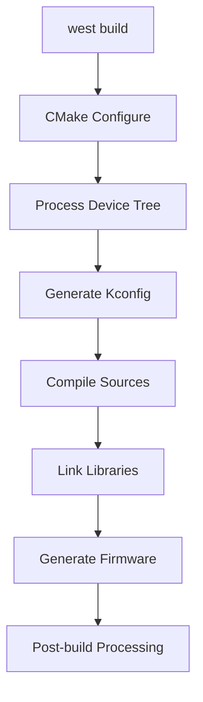

# Chapter 3: Zephyr Build System - Theory

---
[Introduction](./README.md) | [Theory](./theory.md) | [Lab](./lab.md) | [Course Home](../index.md)

---

Building on your hands-on experience from Chapter 2, let's explore the technical details of how Zephyr transforms source code into executable firmware. This deep dive will give you the knowledge to customize, optimize, and troubleshoot your build process.

---

## West Build System Architecture

### West's Role in Zephyr Development

West is more than just a build tool - it's a multi-repository project manager designed specifically for complex embedded systems development. Unlike traditional build systems that work with single repositories, West manages the entire Zephyr ecosystem.

**Multi-Repository Management:**
```
zephyrproject/                 # West workspace
├── .west/                     # West metadata and configuration
├── zephyr/                    # Main Zephyr RTOS repository
├── modules/
│   ├── hal/                   # Hardware abstraction layers
│   │   ├── nordic/           # Nordic Semiconductor drivers
│   │   ├── stm32/            # STM32 HAL
│   │   └── espressif/        # ESP32 components
│   ├── lib/
│   │   ├── cjson/            # JSON parsing library
│   │   ├── mbedtls/          # Cryptographic library
│   │   └── littlefs/         # Filesystem implementation
│   └── crypto/               # Cryptographic implementations
├── tools/                     # Development tools
└── bootloader/               # MCUboot secure bootloader
```

**Key West Commands and Their Functions:**

```bash
# Project initialization and updates
west init ~/zephyrproject       # Initialize workspace
west update                     # Sync all repositories
west status                     # Show repository states

# Building and configuration
west build -b rpi_4b app/       # Build application for Raspberry Pi 4B
west build -b rpi_4b app/ -p    # Pristine build (clean first)
west build -t menuconfig        # Open configuration menu
west build -t clean            # Clean build artifacts

# Deployment and debugging
west flash                      # Flash to connected device
west debug                      # Start debugging session
west attach                     # Attach debugger to running target
```

### West Configuration Files

**west.yml (Manifest File):**
Defines repositories, versions, and dependencies:

```yaml
manifest:
  defaults:
    remote: upstream
    
  remotes:
    - name: upstream
      url-base: https://github.com/zephyrproject-rtos
      
  projects:
    - name: zephyr
      revision: main
      path: zephyr
    - name: hal_nordic
      revision: 57d9fc59c9ea86465b5cd26f0fe2b9dcc520768b
      path: modules/hal/nordic
      groups:
        - hal
```

**.west/config (Local Configuration):**
```ini
[manifest]
path = zephyr

[zephyr]
base = zephyr

[build]
board = rpi_4b
```

## CMake Integration in Zephyr

### CMake Build Process Flow

Zephyr uses CMake as its underlying build system, but with significant customizations for embedded development:



### Essential CMake Functions

**Basic Application CMakeLists.txt:**
```cmake
# Minimum CMake version
cmake_minimum_required(VERSION 3.20.0)

# Find Zephyr package
find_package(Zephyr REQUIRED HINTS $ENV{ZEPHYR_BASE})

# Define project
project(my_application)

# Add source files
target_sources(app PRIVATE
    src/main.c
    src/sensors.c
    src/networking.c
)

# Include directories
target_include_directories(app PRIVATE
    include/
    src/
)

# Link libraries
target_link_libraries(app PRIVATE
    subsys__net
    drivers__sensor
)
```

**Advanced CMake Techniques:**

```cmake
# Conditional compilation based on configuration
if(CONFIG_NETWORKING)
    target_sources(app PRIVATE src/network_manager.c)
endif()

# Board-specific source files
if(BOARD STREQUAL "rpi_4b")
    target_sources(app PRIVATE src/rpi_specific.c)
elseif(BOARD STREQUAL "nrf52840dk_nrf52840")
    target_sources(app PRIVATE src/nordic_specific.c)
endif()

# Custom compile definitions
target_compile_definitions(app PRIVATE
    -DAPP_VERSION="1.2.3"
    -DDEBUG_LEVEL=2
)

# Custom compiler flags
target_compile_options(app PRIVATE
    -Wall
    -Wextra
    -O2
)
```

## Application Structure and Organization

### Recommended Project Layout

**Small Application Structure:**
```
my_app/
├── CMakeLists.txt            # Build configuration
├── prj.conf                  # Kconfig settings
├── README.md                 # Project documentation
├── src/
│   └── main.c               # Application entry point
├── include/
│   └── app_config.h         # Application headers
└── boards/                   # Board-specific configurations
    └── rpi_4b.conf          # Raspberry Pi 4B specific settings
```

**Complex Application Structure:**
```
complex_iot_app/
├── CMakeLists.txt
├── prj.conf
├── Kconfig                   # Custom Kconfig options
├── VERSION                   # Version information
├── src/
│   ├── main.c
│   ├── sensors/
│   │   ├── temperature.c
│   │   ├── humidity.c
│   │   └── CMakeLists.txt
│   ├── networking/
│   │   ├── wifi_manager.c
│   │   ├── mqtt_client.c
│   │   └── CMakeLists.txt
│   └── storage/
│       ├── flash_storage.c
│       └── CMakeLists.txt
├── include/
│   ├── sensors/
│   ├── networking/
│   └── storage/
├── tests/                    # Unit tests
│   ├── CMakeLists.txt
│   └── src/
├── boards/                   # Board-specific configurations
│   ├── rpi_4b.conf
│   ├── rpi_4b.overlay       # Device tree overlay
│   └── nrf52840dk_nrf52840.conf
├── dts/
│   └── bindings/            # Custom device tree bindings
└── scripts/                 # Build and deployment scripts
    ├── flash.sh
    └── test.sh
```

### Modular CMake Organization

**Parent CMakeLists.txt:**
```cmake
cmake_minimum_required(VERSION 3.20.0)
find_package(Zephyr REQUIRED HINTS $ENV{ZEPHYR_BASE})
project(complex_iot_app)

# Add main source
target_sources(app PRIVATE src/main.c)

# Add subdirectories (modules)
add_subdirectory(src/sensors)
add_subdirectory(src/networking)
add_subdirectory(src/storage)

# Global include directories
target_include_directories(app PRIVATE include/)
```

**Module CMakeLists.txt (src/sensors/CMakeLists.txt):**
```cmake
# Add sensor module sources
target_sources(app PRIVATE
    ${CMAKE_CURRENT_SOURCE_DIR}/temperature.c
    ${CMAKE_CURRENT_SOURCE_DIR}/humidity.c
)

# Module-specific includes
target_include_directories(app PRIVATE
    ${CMAKE_CURRENT_SOURCE_DIR}/../include/sensors
)

# Module-specific libraries
if(CONFIG_SENSOR_BME280)
    target_sources(app PRIVATE ${CMAKE_CURRENT_SOURCE_DIR}/bme280.c)
endif()
```

## Toolchains and Cross-Compilation

### Understanding the Zephyr SDK

The Zephyr SDK provides:

**Cross-Compilation Toolchains:**
* **ARM:** arm-zephyr-eabi-gcc for Cortex-M and Cortex-A processors
* **RISC-V:** riscv64-zephyr-elf-gcc for RISC-V architectures
* **x86:** x86_64-zephyr-elf-gcc for x86/x86_64 targets
* **ARC:** arc-zephyr-elf-gcc for ARC processors

**Host Tools:**
* Device tree compiler (dtc)
* Generator for various output formats
* Debugging tools and utilities

### Toolchain Configuration

**Environment Variables:**
```bash
# Zephyr SDK configuration
export ZEPHYR_TOOLCHAIN_VARIANT=zephyr
export ZEPHYR_SDK_INSTALL_DIR=~/zephyr-sdk-0.17.4

# Cross-compilation settings (automatically set by Zephyr)
export CROSS_COMPILE=arm-zephyr-eabi-
export CC=arm-zephyr-eabi-gcc
export CXX=arm-zephyr-eabi-g++
```

**CMake Toolchain Selection:**
Zephyr automatically selects the appropriate toolchain based on:
1. Target board architecture
2. ZEPHYR_TOOLCHAIN_VARIANT environment variable
3. Available toolchains in the SDK

### Custom Toolchain Configuration

**Using Alternative Toolchains:**
```bash
# Use LLVM/Clang instead of GCC
export ZEPHYR_TOOLCHAIN_VARIANT=llvm

# Use ARM Compiler 6
export ZEPHYR_TOOLCHAIN_VARIANT=armclang

# Use custom toolchain
export ZEPHYR_TOOLCHAIN_VARIANT=cross-compile
export CROSS_COMPILE=arm-linux-gnueabihf-
```

## Build Optimization and Configuration

### Kconfig Integration

The build system integrates tightly with Kconfig for feature selection:

**prj.conf Example:**
```bash
# Core system configuration
CONFIG_MAIN_STACK_SIZE=4096
CONFIG_SYSTEM_WORKQUEUE_STACK_SIZE=2048

# Enable networking
CONFIG_NETWORKING=y
CONFIG_NET_IPV4=y
CONFIG_NET_TCP=y

# Enable sensors
CONFIG_SENSOR=y
CONFIG_BME280=y

# Board-specific optimizations
CONFIG_FPU=y
CONFIG_SPEED_OPTIMIZATIONS=y
```

**Conditional Build Logic:**
```cmake
# Include networking code only if enabled
if(CONFIG_NETWORKING)
    target_sources(app PRIVATE src/network_manager.c)
    target_link_libraries(app PRIVATE subsys__net)
endif()

# Optimize for different scenarios
if(CONFIG_DEBUG)
    target_compile_options(app PRIVATE -O0 -g3)
else()
    target_compile_options(app PRIVATE -Os -DNDEBUG)
endif()
```

### Build Artifacts and Output

**Generated Files:**
```
build/
├── zephyr/
│   ├── zephyr.elf           # ELF executable with debug symbols
│   ├── zephyr.bin           # Raw binary for flashing
│   ├── zephyr.hex           # Intel HEX format
│   ├── zephyr.map           # Memory map and symbol table
│   ├── zephyr.dts           # Compiled device tree
│   └── include/
│       └── generated/       # Generated headers
├── CMakeCache.txt           # CMake configuration cache
└── compile_commands.json    # For IDE integration
```

### Performance Optimization Techniques

**Size Optimization:**
```cmake
# Enable size optimizations
set_property(TARGET app PROPERTY COMPILE_OPTIONS -Os)

# Remove unused sections
target_link_options(app PRIVATE -Wl,--gc-sections)

# Strip debug information in release builds
if(NOT CONFIG_DEBUG)
    target_link_options(app PRIVATE -Wl,--strip-debug)
endif()
```

**Build Time Optimization:**
```bash
# Use Ninja build system (faster than Make)
west build -b rpi_4b -- -G Ninja

# Parallel compilation
west build -b rpi_4b -- -j8

# Use ccache for faster rebuilds
export USE_CCACHE=1
```

## Device Tree Integration

### Device Tree in the Build Process

Device tree describes hardware layout and is compiled during build:

**Board Device Tree (boards/raspberrypi/rpi_4b/rpi_4b.dts):**
```dts
/dts-v1/;

#include <broadcom/bcm2711.dtsi>
#include <zephyr/dt-bindings/gpio/gpio.h>

/ {
    model = "Raspberry Pi 4 Model B";
    compatible = "raspberrypi,4-model-b", "brcm,bcm2838";
    
    chosen {
        zephyr,console = &uart1;
        zephyr,shell-uart = &uart1;
        zephyr,sram = &sram0;
    };
    
    leds {
        compatible = "gpio-leds";
        led_act: led-act {
            gpios = <&gpio1 14 GPIO_ACTIVE_HIGH>; /* GPIO 42 */
            label = "ACT";
        };
    };
};
```

**Application Device Tree Overlay (app.overlay):**
```dts
/ {
    sensors {
        compatible = "sensor-array";
        temp_sensor: temperature {
            compatible = "bosch,bme280";
            reg = <0x76>;
            label = "BME280";
        };
    };
};
```

### Build System Device Tree Processing

1. **Preprocessing:** Include files and macros are processed
2. **Compilation:** Device tree compiler (dtc) creates binary blob
3. **Generation:** C headers are generated for driver access
4. **Integration:** Device tree data is linked into firmware

---

This theory foundation prepares you for hands-on practice in the [Lab section](./lab.md), where you'll apply these concepts to build and customize real Zephyr applications.

[Next: Zephyr Build System Lab](./lab.md)
