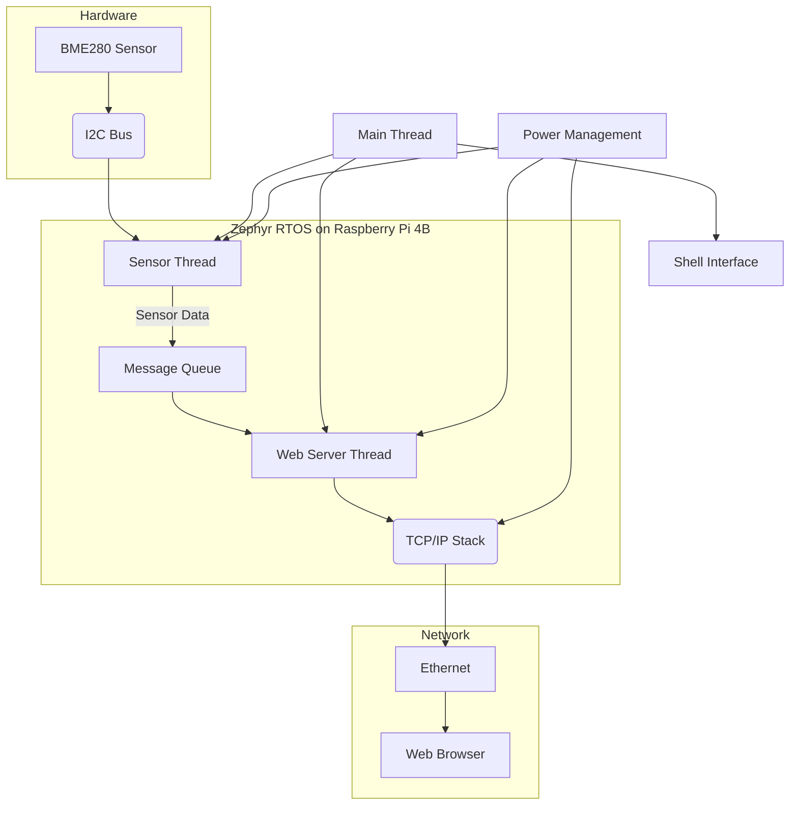

# Chapter 18: Networked Environmental Monitor - Architectural Design

---
[Introduction](./README.md) | [Theory](./theory.md) | [Lab](./lab.md) | [Course Home](../README.md)

---

## System Architecture

The Networked Environmental Monitor is designed as a modular, multi-threaded application that leverages the networking capabilities of the Raspberry Pi 4B. The architecture is centered around a message-passing paradigm, which decouples the different components of the system and allows for concurrent operation.



### Core Components:

*   **Sensor Thread:** A dedicated thread responsible for periodically reading data from the BME280 sensor via the I2C bus.
*   **Web Server Thread:** This thread runs a simple HTTP server, listening for incoming connections and serving a web page with the latest sensor data.
*   **Message Queue:** A message queue is used to safely pass sensor data from the Sensor Thread to the Web Server Thread. This is a crucial design choice that decouples the sensor reading logic from the networking logic.
*   **Main Thread:** The main thread is responsible for initializing the system, creating the other threads, and can be used for system monitoring or other top-level tasks.
*   **Power Management:** While the Raspberry Pi 4B is a mains-powered device, we will explore power management concepts like CPU frequency scaling and disabling unused peripherals.
*   **Shell Interface:** Provides a command-line interface for debugging, configuration, and status monitoring.

## Thread Design and Communication

The multi-threaded architecture allows for concurrent operation, which is essential for a responsive and efficient embedded system.

*   **Sensor Thread:** This thread will wake up at a configurable interval (e.g., every 5 seconds), read the temperature, humidity, and pressure from the BME280 sensor, and then put the data into the message queue. After posting the data, the thread will go back to sleep.

*   **Web Server Thread:** This thread will create a listening socket and wait for incoming HTTP requests. When a request is received, it will read the latest sensor data from the message queue (or a shared data structure) and generate an HTML or JSON response.

### Why a Message Queue?

A message queue is the ideal communication primitive for this application for several reasons:

*   **Decoupling:** It decouples the Sensor Thread from the Web Server Thread.
*   **Buffering:** The message queue provides a buffer, which can hold multiple sensor readings if the Web Server Thread is busy handling requests.
*   **Structured Data:** Message queues are designed for passing structured data, like our `sensor_reading` struct, in a thread-safe manner.
*   **Asynchronous Communication:** The threads can operate asynchronously.

## Power Management Strategy

While the Raspberry Pi 4B is not a low-power device, we can still apply power management principles:

*   **CPU Frequency Scaling:** The CPU frequency can be scaled down during periods of low activity to reduce power consumption.
*   **Peripheral Power Management:** Unused peripherals can be powered down.
*   **Efficient Coding:** Writing efficient code that avoids busy-waiting and uses sleep/yield functions appropriately will also reduce power consumption.

## Web Server Design

A simple HTTP server will be implemented using Zephyr's socket APIs. The server will have a single endpoint (`/`) that returns the latest sensor data.

*   **Endpoint:** `GET /`
*   **Response:** A simple HTML page that displays the temperature, humidity, and pressure. The page will automatically refresh to show the latest data.

```html
HTTP/1.1 200 OK
Content-Type: text/html

<html>
<head><title>Smart Weather Station</title></head>
<body>
<h1>Smart Weather Station</h1>
<p>Temperature: 25.5 C</p>
<p>Humidity: 45.2 %</p>
<p>Pressure: 1012.5 hPa</p>
</body>
</html>
```

## Modular and Configurable Design

Following the principles from Chapters 14 and 15, the project will be structured in a modular and configurable way:

*   **Modules:** The sensor reading logic and web server logic will be separated into their own modules (`sensor_manager.c`, `web_server.c`) to promote code reuse and maintainability.
*   **Kconfig:** Key parameters will be exposed as Kconfig options, allowing for easy customization of the application without changing the source code. These will include:
    *   `CONFIG_SENSOR_READ_INTERVAL`: The interval in seconds between sensor readings.
    *   `CONFIG_WEB_SERVER_PORT`: The port for the web server.

This architectural design provides a solid foundation for building a robust, efficient, and maintainable Networked Environmental Monitor. The [next section](./lab.md) will provide the step-by-step guide to implementing this design.

[Next: Implementation Lab](./lab.md)
